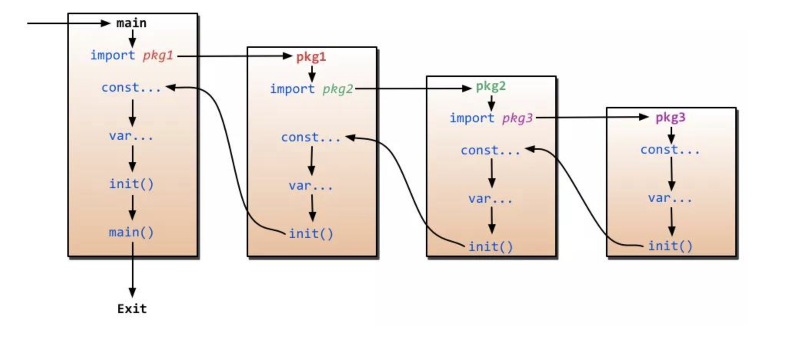

# Notes

## 1

1. init() 函数是用于程序执行前做包的初始化的函数，比如初始化包里的变量等
2. 一个包可以出线多个 init() 函数,一个源文件也可以包含多个 init() 函数
3. 同一个包中多个 init() 函数的执行顺序没有明确定义，但是不同包的 init 函数是根据包导入的依赖关系决定的（看下图）
4. init() 函数在代码中不能被显示调用、不能被引用（赋值给函数变量），否则出现编译错误
5. 一个包被引用多次，如 A import B,C import B,A import C，B 被引用多次，但 B 包只会初始化一次
6. 引入包，不可出现死循坏。即 A import B,B import A，这种情况编译失败



## 2

在 Go 语言中，cap() 函数用于返回一个切片、数组或通道的容量（capacity）。它是 Go 语言的内置函数之一。

适用范围:

1. 切片 (slice)
2. 数组 (array)
3. 通道 (channel)

## 3

这两种写法有显著区别，主要体现在 Go 语言中的嵌套类型（匿名字段）和普通字段的差异：

---

### **写法 1：**

```go
type Teacher struct {
    People
}
```

- **匿名字段嵌套：**

  - `People` 是匿名字段。
  - 这种情况下，`Teacher` 结构体**继承了 `People` 的字段和方法**。换句话说，可以直接通过 `Teacher` 的实例访问 `People` 的字段和方法，而不需要额外的字段名称前缀。
  - **示例：**

    ```go
    type People struct {
        Name string
        Age  int
    }

    type Teacher struct {
        People
    }

    func main() {
        t := Teacher{
            People: People{
                Name: "Alice",
                Age:  30,
            },
        }

        fmt.Println(t.Name) // 直接访问 People 的字段，输出: Alice
        fmt.Println(t.Age)  // 输出: 30
    }
    ```

- **方法绑定：**
  - 如果 `People` 类型有方法，这些方法会提升到 `Teacher`，也就是说，可以直接通过 `Teacher` 调用 `People` 的方法。

---

### **写法 2：**

```go
type Teacher struct {
    p People
}
```

- **普通字段嵌套：**

  - `p` 是 `Teacher` 的一个普通字段，类型为 `People`。
  - 在这种情况下，`People` 的字段和方法不会直接提升到 `Teacher`，访问时必须通过 `p` 字段。
  - **示例：**

    ```go
    type People struct {
        Name string
        Age  int
    }

    type Teacher struct {
        p People
    }

    func main() {
        t := Teacher{
            p: People{
                Name: "Alice",
                Age:  30,
            },
        }

        fmt.Println(t.p.Name) // 需要通过 p 字段访问，输出: Alice
        fmt.Println(t.p.Age)  // 输出: 30
    }
    ```

- **方法绑定：**
  - 如果 `People` 类型有方法，这些方法不会提升到 `Teacher`。
  - 只能通过 `t.p` 的形式调用 `People` 的方法。

---

### **总结对比：**

| 特性             | 写法 1 (`People`)          | 写法 2 (`p People`)          |
| ---------------- | -------------------------- | ---------------------------- |
| 字段访问方式     | 直接访问                   | 通过字段名称访问 (`t.p`)     |
| 方法提升         | 提升到 `Teacher`           | 不会提升                     |
| 嵌套类型是否匿名 | 是                         | 否                           |
| 适合场景         | 需要复用父类型的方法和字段 | 字段隔离或有多个相同类型嵌套 |

**选择依据：**

- 如果需要 `Teacher` 直接具有 `People` 的行为（字段和方法），使用匿名字段（写法 1）。
- 如果 `Teacher` 只是包含一个 `People` 的实例，而不希望暴露其所有字段和方法，使用普通字段（写法 2）。
